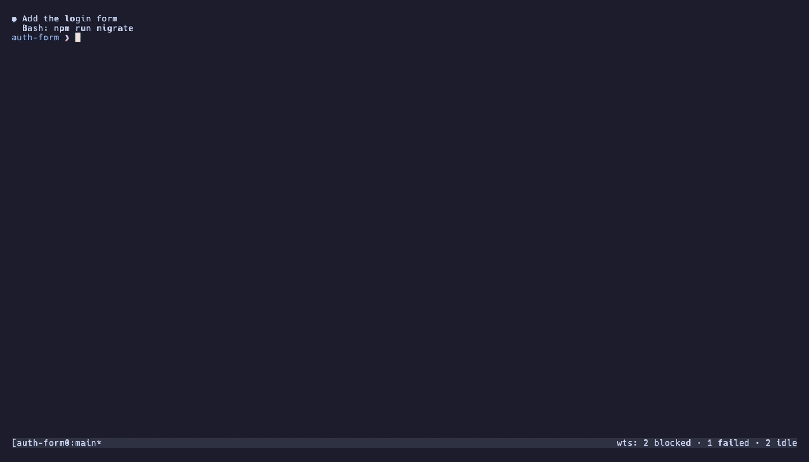

# The switcher

`prefix+s` opens an fzf popup that lists your sessions by urgency, shows a live
preview of each agent's pane, and lets you answer an agent without leaving the
popup. It also lists the tasks you have not started yet. It comes with the tmux
snippet ([install.md](install.md#the-tmux-integration)).

```
wts keys
wts status --fzf
```

`wts keys` prints the switcher's keys and the tmux bindings in a terminal, for
when the popup is not open.

## What is on screen

- **The list.** Sessions sorted by urgency, the same order as `wts ls`
  ([watching.md](watching.md#agent-state)), with agent state, branch, git delta
  and, once [refreshed](watching.md#pull-requests), the PR. Once the sessions
  span several repositories, a REPO column names each row's, as in `wts ls`.
  tmux sessions unknown to wts are listed after.
- **Marks.** `*` after a name marks the session you came from, as tmux marks
  its current window. `@` at the start of SUBJECT marks a session that serves a
  [task](tasks.md).
- **The tasks.** Under the sessions, the open tasks: see
  [tasks.md](tasks.md#tasks-in-the-switcher).
- **The preview**, on the right half:
  1. the agent's state, for how long, and the question it waits on when there
     is one (`blocked 4m: Bash: rm -rf dist`);
  2. dimmed, what the session already said about itself: the cached `done:` /
     `next:` of `wts brief` with its age, and the last two notes its agent left
     with `wts db set`. These come from the database, never a model call, and
     are dropped on a popup too short to spare the lines;
  3. the pane itself.
- **The footer**, under the list: the keys, so there is nothing to remember
  (see below).

## Keys

| Key            | On a session | On a task |
|----------------|--------------|-----------|
| `enter`        | switch to it | choose what to do with it |
| `tab`          | reply to the agent ([reply mode](#answering-an-agent-tab)) | note on the task |
| `ctrl-g`       | only what needs you, or every row ([below](#only-what-needs-you-ctrl-g)) | same |
| `ctrl-x`       | stop the session, keep the worktree (`wts stop`) | |
| `ctrl-d`       | remove the session (`wts rm`) | close a local task (`wts task done`) |
| `ctrl-o`       | open the pull request on GitHub (`wts pr`) | |
| `ctrl-e`       | attach a [context document](documents.md) (`wts doc use`) | attach a document to the task (`wts task doc`) |
| `ctrl-t`       | new task (`wts task new`); on an empty title, from Things (`wts task add`) | same |
| `ctrl-f` / `ctrl-b` | scroll the preview half a page | same |
| `ctrl-r`       | reload the list now | same |
| `esc`          | close, or leave reply mode | same |
| `?`            | show or hide these keys | same |

Details of each:

- **`ctrl-x`** asks y/N first. The tmux session closes; the worktree, the
  branch and the registry entry stay. The popup stays open and the row reads
  `stopped`. It works on tmux sessions unknown to wts too.
- **`ctrl-d`** asks y/N first, with a prompt that names the session, its agent
  state and whether it is merged.
- **`ctrl-o`** goes through `gh pr view --web`. Without a PR the popup says so
  and stays open. Without `gh` the key is neither bound nor listed.
- **`ctrl-e`** attaches the document and tells the agent, picker included.
- The current session is never stopped from the popup, which it would close.

### The footer

- One line by default; `?` unfolds the whole table, the tmux bindings included,
  since those are the ones you cannot press from inside the popup.
- It is sized to the list: a narrow popup keeps the keys you press most and
  drops the rest; `?` still shows them all.
- While you are filtering the list, `?` is typed into the query instead (the
  AGENT column has `stuck?` in it).
- In reply mode the footer shows what `enter` and `esc` do there.
- It needs fzf 0.65 or later; older versions keep the plain switcher and
  `wts keys`.

## Answering an agent: `tab`

`tab` **answers the agent without leaving the popup**.

1. The prompt becomes `reply to <session>>`, and what you type no longer
   filters the list.
2. `enter` sends the line to the agent's pane followed by Enter: a number for
   Claude's numbered questions and permission prompts, a sentence for the rest,
   nothing at all for a bare Enter.
3. The preview keeps refreshing, so the agent's reaction shows up in place.
4. `esc` or `tab` brings the list back (`enter` switches again).

Rules:

- The reply stays pinned to the session you pressed `tab` on, even if the list
  re-sorts under the cursor.
- `ctrl-d`, `ctrl-x`, `ctrl-e`, `ctrl-t`, `ctrl-g` and `?` are disabled
  meanwhile.
- While the agent column shows `-`, wts does not know the agent's pane yet and
  the reply is refused (`no agent pane known — not sent`). The reply goes to the
  agent's own pane, never to the session's active pane (the editor of the
  default layout); `ctrl-e` follows the same rule.
- It needs fzf 0.45 or later; older versions keep the plain switcher.

## Only what needs you: `ctrl-g`



At ten sessions and more, the list is longer than the popup.

- Its first line counts the sessions per agent state: `all 12: 2 blocked 1 idle
  7 working 2 done`.
- **`ctrl-g` keeps only the ones that need you**: blocked, `stuck?`, failed or
  idle, the agents `prefix+a` cycles through. The prompt reads `needs you>`, and
  the first line says what that view holds: `needs you 3/12: 2 blocked 1 idle`.
- `ctrl-g` again brings every row back.
- The view lasts as long as the popup: each `prefix+s` opens on every row.

The toggle redraws the rows of the last refresh at once, without waiting for
git, and the columns keep their widths.

## Scrolling the preview

At rest the preview follows the end of the pane. `ctrl-b` goes back through the
real tmux history (`WTS_SWITCH_SCROLLBACK` lines, 2000), `ctrl-f` forward.
Moving to another session returns to live.

Trade-off: `ctrl-f` / `ctrl-b` do not move the cursor in the query; the arrow
keys do.

## How it works

### Drawn at once

The popup is drawn on a list built from the registry and tmux alone: no git, no
agent call. fzf then swaps in the agent states (`load`, then `reload-sync` of a
pass that asks Claude and tmux but not git: tens of milliseconds), and the
first refresh brings the git columns. Until then the columns show `-`: an
agent state one refresh old is worse than no state at all.

### The 2-second refresh

The list and the preview refresh every 2 s (`WTS_SWITCH_REFRESH`, `0` for a
static list). fzf has no timer event, so the refresh goes through `--listen`: a
background poller pushes `reload-sync(...)+refresh-preview` to fzf's unix
socket.

- `reload-sync` avoids a blinking empty list and keeps the cursor and query.
- The poller never replaces a pass still running, and waits at least as long as
  the last pass took before starting the next one. On a large repository where
  a pass takes seconds, the list fills after one pass and the preview keeps
  refreshing in between.
- The poller dies with the popup.
- Without `curl`, or when the socket path exceeds the 104 bytes of `sun_path`,
  the switcher silently falls back to a static list.
- The cursor is kept by index: if a session changes urgency, the highlighted
  line can change session under you.

The task rows come from one query of wts's own database: no Things, no git, no
model, because it runs every 2 s.

### The scroll offset

The scroll offset lives outside fzf, in a small file the preview command reads:
every `refresh-preview` resets fzf's own preview offset, so native scrolling
would be undone within two seconds.

### The table and the preview width

The list is a table sized to the popup: the session and branch columns take the
width of their longest value, capped so that every column stays visible, and a
cell too long for its column is cut with `…` rather than pushing its row out of
line.

The preview window is as wide as the agent's pane, up to the right half it
starts with. The preview is a raw `capture-pane`, text at the pane's width: with
the editor as the main pane, a 56-column agent pane drawn in a 110-column window
would leave half of it blank while the list is squeezed to 76 columns and loses
the subject.

- The width follows the highlighted session (`focus` → `transform` →
  `change-preview-window`, fzf 0.46 or newer; older versions keep the
  half-width window).
- The list is laid out for the other half, so a wider pane is truncated on the
  right rather than pushed into the list.

## Tip: `choose-tree` with digits only

Not included in the snippet: `choose-tree` assigns jump keys to its lines, so
`j` / `k` select a line instead of moving once enough sessions are open. This
keeps jump keys to digits:

```tmux
bind w choose-tree -Zw -K '#{?#{e|<:#{line},10},#{line},}'
```
