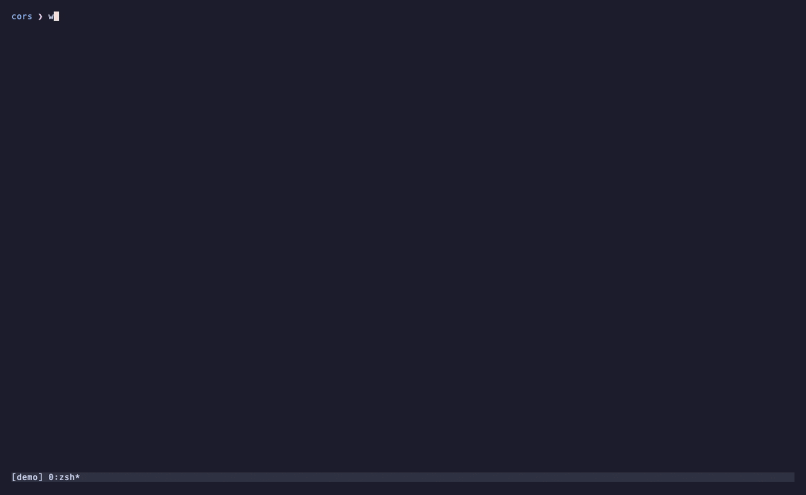

# Watching your sessions

What each agent is doing and since when, how wts tells you when one needs you,
where each session stands (`wts brief`), what the agents cost, how full their
context is, and the state of their pull requests. The popup that shows all of it is in
[switcher.md](switcher.md).

```
wts ls [--wide] | wts status [--json|--table [--wide]|--fzf]
wts brief [name...] | brief --cached [--json] [name...]
wts pr [name] | pr --refresh [--json] [name...]
```

- `wts ls` lists registered sessions and their state: agent and since when,
  branch, git delta, tmux state, and REPO once sessions span two repositories.
  It takes `--wide` alone.
- `wts status` is the same collection, as JSON (`--json`), a table (`--table`)
  or fzf lines (`--fzf`): it is the one with formats.

## Agent state

`wts ls` and the switcher show the Claude Code agent running in each worktree.

| Shown     | Source                               | Meaning                               |
|-----------|--------------------------------------|---------------------------------------|
| `blocked` | `state: blocked` / `status: waiting` | waiting for a permission or an answer |
| `working` | `status: busy` / `state: working`    | turn in progress                      |
| `idle`    | `status: idle`                       | turn finished, prompt available       |
| `done`    | `state: done`                        | background session finished           |
| `failed`  | `state: failed`                      | the turn failed                       |
| `stopped` | `state: stopped`, the agent's own `SessionEnd`, or no tmux session | the agent quit, or the session was `wts stop`ped: the switcher shows it for a dead tmux session |
| `stuck?`  | stale guard                          | says `working`, but the pane is frozen |
| `-`       | no agent found                       | worktree without a Claude session     |

**The stale guard.** An agent reported as `working` whose pane has not changed
for `WTS_STALE_AFTER` seconds (10) is shown as `stuck?`. Without it, a `Ctrl-C`
leaves a session "working" forever.

**Since when.** `wts ls` puts it next to the state (`blocked 4m`, `idle
1h12m`).

**Order.** Sessions are sorted by what needs a human first: `stuck?`,
`blocked`, `failed`, `idle`, `working`, then the rest; among equals, the one
waiting longest. A merged session goes last, whatever its agent says.

### `wts ls --wide`

```
$ wts ls --wide
SESSION      AGENT       BRANCH       DELTA        DIRTY  TMUX     TOKENS  COST    MODEL     CTX  WAITING           SUBJECT
auth-form    blocked 4m  auth-form    +322/-0 ^4   no     running  13.6M   $5.64   opus-5-5  84%  Bash: npm run db  Server-side email validation
rate-limit   working 9m  rate-limit   +80/-2 ^1    yes    running  2M      $1.95   opus-5-5  31%  -                 Rate-limit the public API
```

`--wide` adds tokens, API-price cost and model ([Tokens and
cost](#tokens-and-cost)), CTX, the share of the context window in use as the
agent's [status line](#claude-codes-status-line) last reported it (`-`
without one), and a WAITING column: the permission or the question a blocked
agent waits on.

### `wts status --json`

The same data for scripts. Keys are added, never renamed.

| Key                 | Value |
|---------------------|-------|
| `agent_state`       | `blocked`, `working`, `idle`, `done`, `failed`, `stopped`, or `null` (shown as `-`) |
| `stale`             | the stale guard, a boolean: `true` is what shows as `stuck?` |
| `agent_since`       | the epoch of the event that put the agent in its state |
| `agent_waiting_for` | the permission or the question |
| `agent_source`      | `agents` or `events` (see [The agent's own events](#the-agents-own-events)) |
| `merged`            | see below |
| `pr`                | see [Pull requests](#pull-requests) |
| `usage`             | see [Tokens and cost](#tokens-and-cost) |
| `context_pct`       | the share of the context window in use, 0 to 100, as the agent's [status line](#claude-codes-status-line) last reported it; `null` without one |
| `rate_limits`       | `{five_hour, seven_day}`: the account's rate limits used, in percent, as that agent last saw them; `null` without a reading (an API key has none) |
| `cost_reported_usd` | Claude Code's own running cost of the session's conversations, summed; `null` without a reading. `usage` stays the ledger |

plus the git counters and the tmux state.

`merged` is true once the branch's content is in the base, squash and rebase
included, or once `gh` saw its pull request merged at the branch's current tip
(the test `wts gc` uses, see [cleanup.md](cleanup.md#how-a-merged-branch-is-recognized)),
and false for a branch nothing was committed to yet.

## When an agent needs you

Opening the switcher is a poll. The [hooks](install.md#the-claude-code-integration)
make it a push. On a `Notification` (a permission to grant, a question to
answer) and on a `Stop` (the turn is over):

- **a bell** rings on the pane: tmux flags the window, and a theme that draws
  flags shows it;
- **a desktop banner** names the wts session: *wts: auth-form needs you — Bash:
  rm -rf dist*, or *wts: auth-form is done — turn finished in 4m12s*.

Both are skipped when the pane is already under your eyes: the session
attached, the window active and, on macOS, a terminal in front
(`WTS_NOTIFY_TERMINALS`).

The banner goes through `terminal-notifier` when it is on your `PATH` (or named
by `WTS_NOTIFIER`), and a click on it switches the tmux client to the session.
Else through macOS's own notification, else `notify-send`.

| `WTS_NOTIFY` | Effect |
|--------------|--------|
| `1` (default) | bell and banner |
| `0`          | neither |
| `bell`       | the bell only |
| `banner`     | the banner only |

If you had wired a notifier of your own on these hook events, this replaces it:
remove yours, or you will hear both.

**The status line** carries the count, from the snippet `wts setup tmux`
prints: `wts: 2 blocked · 1 idle`, and nothing at all when nobody needs you.

**`prefix+a`** jumps straight to the agent that needs you (`stuck?`, `blocked`,
`failed`, `idle`) and has waited longest, without a popup, and says why in the
status line: *wts: auth-form — blocked 4m: Bash: rm -rf dist*. Pressing it again
cycles through them.

## Claude Code's status line

```
wts setup claude --statusline
```



An opt-in, apart from `wts setup claude --install`: it makes `wts-hook
statusline` the `statusLine` of Claude Code's `settings.json`. In a wts session
the line under the prompt reads

```
wts auth-form · Opus 5.5 · ctx 84% · 2 session(s) need you · 1 unseen note(s)
```

- **ctx** is the share of the context window in use: past 80% the agent is
  close to compacting.
- **need you**: the other sessions whose agent waits on a permission or an
  answer, as their hooks last said (the reading `wts ls` makes when `claude
  agents` cannot be asked), less than twelve hours old.
- **unseen notes**: the notes the same repository's sessions left that this
  agent has not been handed yet. Its next prompt will.

A count of zero is left out. Outside a wts session the line is the model and
the context alone, and nothing is recorded.

**What it records.** At each refresh, the payload Claude Code hands the status
line goes into the `agent_gauges` table: the context in use, the account's
five-hour and seven-day rate limits, and Claude Code's own cost of the
conversation. `wts status --json` reads it (`context_pct`, `rate_limits`,
`cost_reported_usd`), `wts ls --wide` shows CTX, and the switcher the context
in the preview and a `[ctx 84%]` mark on a row at 80% or more
([switcher.md](switcher.md#what-is-on-screen)). The cost is Claude Code's figure, kept
next to [the ledger](#tokens-and-cost), not in place of it.

One sqlite3 process per refresh and nothing else, about 30 ms: the payload is
parsed by SQLite, the session found from the working directory (or the name
Claude Code was started with).

**A status line of your own.** `--statusline` writes the setting only when
there is none or it is wts's; otherwise it leaves yours and prints a command
that runs both, one line each, to put in by hand. `wts doctor` reports which
one is set, as optional.

## Where each session stands: `wts brief`

```
auth-form  idle  feature/auth-form  +322/-0 ^4  PR #42
  done: server-side email validation before sending
  next: decide the wording of the rate-limit error
```

For each session whose worktree exists, in `wts ls` order, `wts brief` prints
two lines, *done* and *next*, written by Claude Haiku from:

- git: commits unique to the branch, excluding both `<base>` and
  `origin/<base>`; delta; uncommitted changes;
- the agent state;
- the worktree's Claude transcript: title, PR link, your last message, the tail
  of the agent's messages, the starting task.

Before it starts, one line says what it is about to cost: `→ 3 haiku call(s), 4
at a time, 2 from the cache`. Up to `WTS_BRIEF_JOBS` calls run at a time.

- **Cached.** While nothing moved, `wts brief` answers instantly.
  `wts brief --cached [--json]` prints the last summaries, from the database,
  with no model call.
- **Without the model.** Without `claude`, with `WTS_NO_LLM=1`, or when the
  answer lacks its `done` or `next` field, the raw facts are shown, under the
  reason the summary is missing.
- The model is never called by `wts ls` or the switcher.

What it sends is in [What is sent to the
model](../README.md#what-is-sent-to-the-model).

## Tokens and cost

`wts brief` also sums what each session's agents consumed, and stores the
tokens per model in the `usage` table. Nothing calls the model for it, so
`WTS_NO_LLM=1 wts brief` counts too. `wts rm` and `wts gc` take a last count at
teardown, and the rows stay with the archive.

`wts ls --wide`, `wts status --json` (`usage`), `wts log` and `wts task show`
read that table, never a transcript: the numbers are as of the last
`wts brief` or teardown, and `-` before the first.

**COST is the API list price** of those tokens: what the work would cost on the
API, not what a subscription bills.

- Cache writes count at 1.25x or 2x input, reads at the model's cache price,
  fast mode at 2x.
- A model the price table does not know counts its tokens but not their price,
  and the cost then reads `~$`.
- wts's own calls count too, under the session they were about: naming it,
  each `wts brief` summary, its retrospective. Their cost is the one
  `claude -p` reported (`total_cost_usd`), so a model the table does not know
  is priced all the same.

## Pull requests

```sh
wts pr                   # open the current session's pull request on GitHub
wts pr auth-form         # or a named one
wts pr --refresh         # ask gh about every session's PR, and cache it
```

`wts pr` needs [gh](https://cli.github.com). It opens the pull request through
`gh pr view --web`; run inside a session, it takes the current one.

`wts pr --refresh` asks `gh` about each session's pull request (number, state,
review decision, checks) and caches the answer. The switcher shows it in a PR
column:

| PR column  | Meaning |
|------------|---------|
| `#42 ✓`    | open, checks passing |
| `#42 ✗ci`  | a check failed |
| `#42 chg`  | changes requested |
| `#42 ...`  | checks running |
| `closed`   | closed |
| `merged`   | merged; the branch's own content can also say it before anyone refreshed |

The preview spells it out (`PR #42 open · checks failing · approved (3m ago)`),
and on a merged session says what `ctrl-d` does. `wts status --json` carries the
same cache under `pr` (`number`, `state`, `review`, `checks`, `merged_at`,
`url`, `refreshed_at`), `null` when there is none.

**Who calls gh.** `gh` is a network call per session, so neither `wts ls`, the
collector nor the switcher's 2-second refresh ever make it. Only:

- `wts pr --refresh`;
- the switcher's slow timer, which runs it in the background when the popup
  opens and then every `WTS_PR_REFRESH` seconds (300; `0` turns it off), once
  for all open popups;
- `wts gc`: after its fetch, one `gh pr list` per repository, for the branches
  it would otherwise leave as unmerged ([cleanup.md](cleanup.md#how-a-merged-branch-is-recognized)).

**Which PR.** The one Claude Code linked in the session's transcript when its
head is the session's branch, else whatever `gh` finds for the branch. A reused
session name would otherwise find the previous incarnation's PR. A failed call
(not logged in, offline) keeps the last answer and records why.

## How it works

### Where the state comes from

The state comes from `claude agents --json`, joined on the agent's `cwd` being
*inside* the worktree, so `WTS_SUBDIR` keeps working.

The stale guard hashes the agent's pane on every refresh: that is how it knows
the pane has not changed. The hashes are kept in the state database.

### The agent's own events

`claude agents` says what state an agent is in, not since when nor what it is
waiting on. The agent knows, and Claude Code says it through its hooks:
`wts setup claude --install` puts `wts-hook` on `SessionStart` (next to
`wts-context`), `UserPromptSubmit`, `Stop`, `Notification` and `SessionEnd`,
and each one writes a row to the `agent_events` table (kept a week). A start
carries its source in `kind`: `startup`, `resume`, `clear` or `compact`.

- The poll remains the word on the state. The events date it (the prompt for
  `working`, the notification for `blocked`, the stop or a start for `idle`)
  and supply the question.
- When claude cannot be asked, or does not list the agent, the last event
  decides the state. An end reads `stopped`: the agent said it was leaving. A
  start after it reads `idle`, since that start: `/clear` (an end and a start
  together), or `claude` run again in the same pane, which used to read
  `stopped` until its first prompt. An end of kind `clear` with no start after
  it reads `idle` too: the install has no start hook yet
  (`wts setup claude --install` adds it).
- A start of kind `compact` changes nothing: a compaction, often in the middle
  of a turn, leaves the state what the events before it said.
- Any other event older than twelve hours leaves no state: that is an agent
  that died without a word.

Outside a wts session the hook is silent, and it never prints on stdout: Claude
Code would add a `UserPromptSubmit` hook's output to the conversation.

### How `wts brief` gathers and caches

Gathering the facts calls nothing. Only the summary calls Claude Haiku, with the
same isolation as naming a session.

Each summary is cached in the state database (table `briefs`), keyed on HEAD,
uncommitted changes and the transcript's size and date. The transcript used is
the one the agent's hooks named (`transcript_path` in every payload, kept in
`agent_panes.transcript`) while that file exists, else the live agent's, else
the most recent one of the worktree's project directory, never one older than
the session, which would belong to a previous session of the same name.
`wts tail`, `wts pr` and the retrospective read the same file.

### How tokens are counted

The count is `message.usage` of every transcript of the worktree no older than
the session: the one after each `/clear` and each subagent's included. Every
message is counted once, although Claude Code repeats its usage on each of its
records. An unchanged transcript is not read again.

wts's own calls are not in any transcript (they run with
`--no-session-persistence`): each one adds its `usage` and `total_cost_usd`,
from the JSON result, to a row whose transcript is `wts:name`, `wts:brief` or
`wts:retro` (`usage_add_call`), with `messages` counting the calls. Reading a
transcript again rewrites only that transcript's rows, so these stay. The
`cost_usd` column holds that price, and is empty on the transcript rows.

The cost is computed when it is read from the table, in `usage_cost_sql`
(`libexec/wts/wts-db.zsh`).
